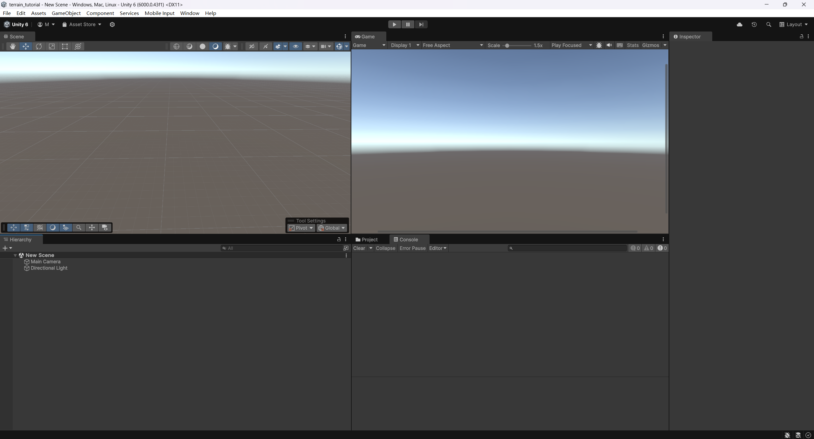
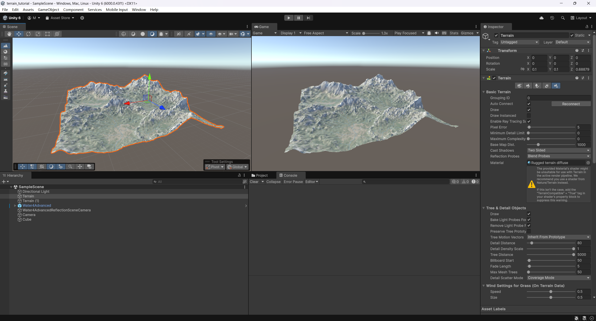
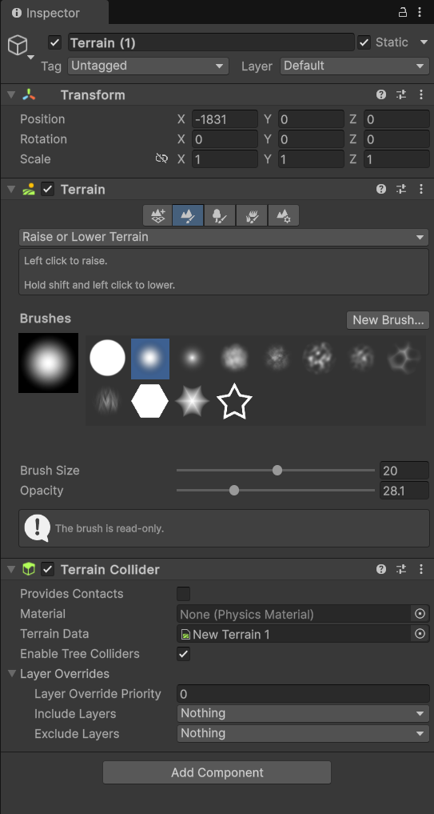
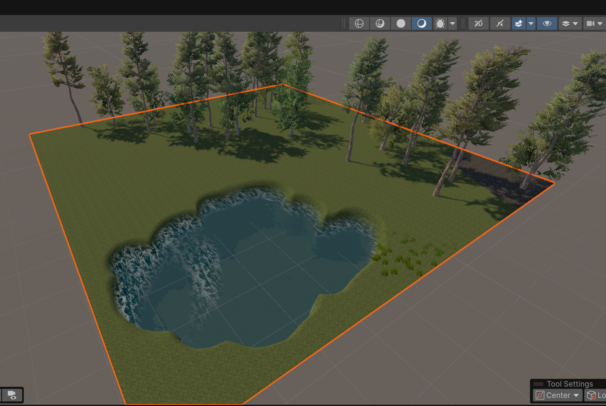
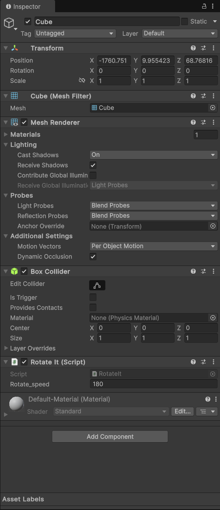
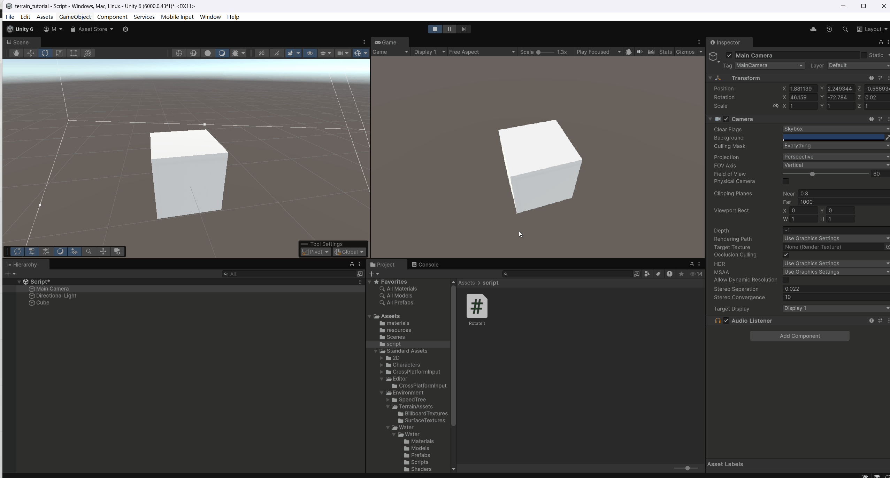

# 游戏引擎基础

### 1.游戏引擎概述

#### 游戏引擎

**狭义**：仅指渲染器（Rendering Engine），负责将场景和模型绘制到屏幕上。

**广义**：整套可视化游戏开发框架，通常包含：

- 渲染引擎 (Rendering)
- 物理引擎 (Physics)
- 碰撞检测系统 (Collision)
- 音频系统 (Audio)
- 脚本编辑与运行时 (Scripting)
- 动画系统 (Animation)
- 网络引擎 (Networking)
- 场景与资源管理 (Scene/Asset Management)


#### 主流引擎与专用模块

| 类型          | 名称      | 功能侧重                              |
| ------------- | --------- | ------------------------------------- |
| **综合引擎**  | Unreal    | 3A级高保真渲染、Blueprint 可视化脚本  |
|               | Unity     | 跨平台、社区庞大、C# 脚本             |
|               | Godot     | 轻量开源、GDScript 与 C# 两种脚本支持 |
| **物理引擎**  | PhysX     | NVIDIA 出品，实时刚体与软体模拟       |
|               | Havok     | 强大的刚体物理与布料、碎片模拟        |
| **植被&环境** | SpeedTree | 高效植被生成与风吹动画                |
| **实时语音**  | Vivox     | 内置跨平台语音/文字聊天服务           |


#### 如何下载安装Unity游戏引擎

##### **下载 Unity Hub**

- 访问官网：https://unity.com/download
- 选择“Download Unity Hub”并安装。

##### **通过 Unity Hub 安装编辑器**

1. 打开 Unity Hub，切换到 “Installs” 标签。
2. 点击 “Add” 选择所需的 Unity 版本（建议最新长期支持版 LTS）。
3. 勾选需要的模块：
   - **Windows/Mac Build Support**
   - **iOS/Android Build Support**（移动导出）
   - **Documentation & Sample Projects**

##### **创建新项目**

1. 切换到 “Projects” 标签页。
2. 点击 “New” 选择 2D/3D 模板，填写项目名称与路径，点击 “Create”。


### 2.Unity游戏引擎简介

#### Unity工作界面布局

Unity 编辑器主要由以下六部分组成：

1. **Project（项目窗口）**
   - 管理所有资源（脚本、预制件、材质、贴图等），支持文件夹分组与搜索。
2. **Hierarchy（层级窗口）**
   - 显示当前场景中的所有GameObject，支持拖拽排序与层级关系管理。
3. **Inspector（检视窗口）**
   - 用于查看与编辑选中对象的组件与属性。
4. **Scene（场景视图）**
   - 编辑关卡、摆放物体、导航摄像机视角；提供移动、旋转、缩放等工具。
5. **Game（游戏视图）**
   - 预览最终渲染效果，并进行输入与交互测试。
6. **Toolbar（工具栏）**
   - 包含播放/暂停/单步按钮、切换场景/游戏视图按钮、布局下拉列表等。

Unity 界面示意图：




### 3.地形系统

#### 高程图与地形构建

三维游戏场景中的地形的基本组成其实是**高程图**：只包含一个颜色通道（灰度值）的像素图

高程图的每个像素的灰度数值的意义是：该位置从地面或者高出海平面的高度，黑色是地面，白色为最高点

#### 在Unity游戏引擎中使用高程图自动构建地形

**1.创建 Terrain 对象**：`GameObject → 3D Object → Terrain`

**2.导入高程图**：在 Terrain Inspector 中点击 “Terrain Settings → Import Raw”

- Raw 图需为 2ⁿ×2ⁿ 分辨率，灰度单通道。

**3.贴图与纹理**：将卫星图或实景图作为 Base Map，或在 “Paint Texture” 面板中添加多层材质。

效果示例：




#### 在Unity游戏引擎中手动编辑地形

选中 Terrain游戏对象，在 Inspector 中使用 **Paint Terrain**工具：

- **Raise/Lower Terrain**（升高/降低）
- **Paint Texture**（绘制纹理）
- **Set Height**（设置高度）
- **Smooth Height**（平滑地形）
- **Stamp Terrain**（印章工具，用外部模板快速雕刻）




#### 在Unity游戏引擎中给地形添加纹理、植被、水体

**纹理**

Terrain Setting → Material → 选择材质（如草地、岩石、沙地）。

**植被**

Paint Trees → Edit Trees → Add Tree → 导入 SpeedTree 或自定义树模型。

Paint Details → Edit Details → 添加草地、碎石、花卉。

**水体**

使用Asset Store里的免费资源。

实现效果示例：




### 4.游戏对象与组件

#### 游戏对象 GameObject

场景中所有实体的容器，本身不含功能，通过添加组件赋予特性。

#### 组件 Component

- 类似于面向对象的属性或接口。

- Unity中的组件是实现游戏功能的零件。

- 可以给原始的游戏对象添加各种组件从而组成特定的游戏物体，如人物，灯光，声音，摄像机等。

#### Transform组件

每个 GameObject 必有组件，用于描述位置（Position）、旋转（Rotation）、缩放（Scale）。

#### 内置游戏对象

游戏引擎内置了一些具备特定组件的游戏物体，如：

**基本几何体**：Cube、Sphere、Plane、Capsule、Cylinder。

**灯光**：Directional Light、Point Light、Spot Light。

**摄像机**：Main Camera，可设置投影模式、视野等。


### 5.编写脚本

#### 脚本在 Unity 中的作用

脚本是使用 Unity 开发的所有应用程序中必不可少的组成部分。大多数应用程序都需要脚本来响应玩家的输入并安排游戏过程中应发生的事件。除此之外，脚本可用于创建图形效果，控制对象的物理行为，甚至为游戏中的角色实现自定义的 AI 系统。

Unity使用的脚本语言是**C#**

#### C# 语言简介

**C#**是[微软](https://zh.wikipedia.org/wiki/微软)推出的一种基于[.NET框架](https://zh.wikipedia.org/wiki/.NET框架)和后来的[.NET](https://zh.wikipedia.org/wiki/.NET)的、[面向对象](https://zh.wikipedia.org/wiki/面向对象程序设计)的高级[编程语言](https://zh.wikipedia.org/wiki/编程语言)。C#衍伸自C和C++，继承了C和C++的强大功能，同时去掉了一些复杂特性，使其成为C语言家族中高效强大的编程语言。


#### 脚本如何起作用

可以将脚本作为组件拖拽到游戏物体的属性窗口中，这样该脚本可以作为该游戏物体的一个组件。

在脚本中声明的Public变量可以暴露在属性窗口中，方便非编程技术人员进行调整。

为了使非编程技术人员:游戏策划人员可以快速高效开发游戏，暴露在属性窗口的变量名应该尽可能清晰明了。


#### 配置Vs Code编写Unity C#脚本

[Unity Development with VS Code](https://code.visualstudio.com/docs/other/unity)

#### 在Unity游戏引擎中使用脚本旋转一个物体

1.在Assets里新建一个MonoBehaviour脚本文件，并编写使其挂载的物体绕着自身的Y轴旋转

```c#
using UnityEngine;

public class RotateIt : MonoBehaviour
{
    public float rotate_speed = 180f; //Angles rotated per second
    
    void Update()
    {
        float rotate_angle_per_frame = rotate_speed * Time.deltaTime; // Angles rotated per frame
        transform.Rotate(0, rotate_angle_per_frame, 0, Space.Self); // Rotate around the Y-axis
    }
}
```

2.保存脚本并将它拖拽的期望起作用的游戏对象的Inspector窗口里，作为这个游戏对象的一部分。



3.点按Game窗口的Play按钮预览效果



