# XR

### 1.VR

#### XR

扩展现实（Extended Reality，简称XR），是指通过计算机将真实与虚拟相结合，打造一个可[人机交互](https://baike.baidu.com/item/人机交互/61313?fromModule=lemma_inlink)的[虚拟环境](https://baike.baidu.com/item/虚拟环境/6529153?fromModule=lemma_inlink)，这也是[AR](https://baike.baidu.com/item/AR/3404706?fromModule=lemma_inlink)(Augment Reality)、[VR](https://baike.baidu.com/item/VR/764830?fromModule=lemma_inlink)(Virtual Reality)、[MR](https://baike.baidu.com/item/MR/19486925?fromModule=lemma_inlink)(Mixed Reality)等多种技术的统称。通过将三者的视觉[交互技术](https://baike.baidu.com/item/交互技术/2495046?fromModule=lemma_inlink)相融合，为体验者带来[虚拟世界](https://baike.baidu.com/item/虚拟世界/859995?fromModule=lemma_inlink)与现实世界之间无缝转换的“沉浸感”。（百度百科）

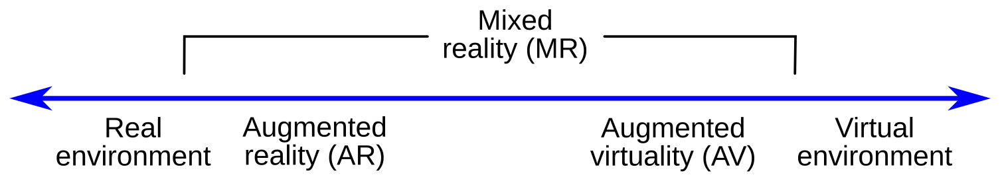

#### XR设备

VR: 手机（将手机画面分为左右两部分）、VR头戴显示器（Meta Quest, PICO, PlayStation VR等）

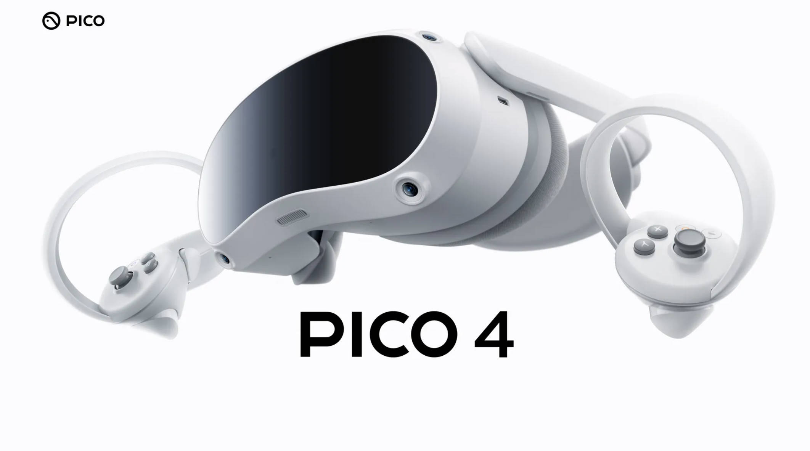

AR: 手机、AR眼镜（雷鸟, XREAL等）

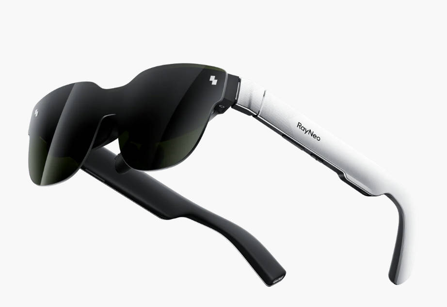

MR: MR头戴显示器（Apple Vision Pro, PICO等）

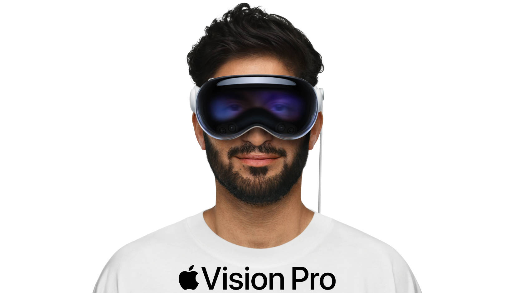

#### VR

虚拟现实技术(英文名称：Virtual Reality，缩写为[VR](https://baike.baidu.com/item/VR/764830?fromModule=lemma_inlink))，其名词最早是由美国VPL Research公司的创建人拉尼尔(Jaron Lanier)于1989年提出的 ，1990年11月27日，[钱学森](https://baike.baidu.com/item/钱学森/26105?fromModule=lemma_inlink)将虚拟现实翻译为“[灵境](https://baike.baidu.com/item/灵境/5445672?fromModule=lemma_inlink)”，又称[灵境](https://baike.baidu.com/item/灵境/5445672?fromModule=lemma_inlink)技术或虚拟实境，是20世纪发展起来的一项全新的[实用技术](https://baike.baidu.com/item/实用技术/9916621?fromModule=lemma_inlink)。

所谓虚拟现实，顾名思义，就是虚拟和现实相互结合（采用特定技术生成一个虚拟的情境，但给人以现实的感觉）。（百度百科）

#### VR内容创作原理 

在VR内容中，左右眼分别对应两个虚拟摄像机，分别从不同的视角渲染同一场景，形成视差以实现立体视觉效果。渲染完成后，通过专用硬件将左右眼画面分别传输至对应的显示区域。用户佩戴设备后的头部姿态信息会实时用于更新虚拟摄像机的位置与朝向，从而实现沉浸式的视角跟随体验。

#### 使用Unity游戏引擎进行VR开发 - 以Steam VR为例

##### 1.导入SteamVR Plugin

打开Asset Store搜索Steam VR插件，并在Package Manager中导入到游戏工程里。

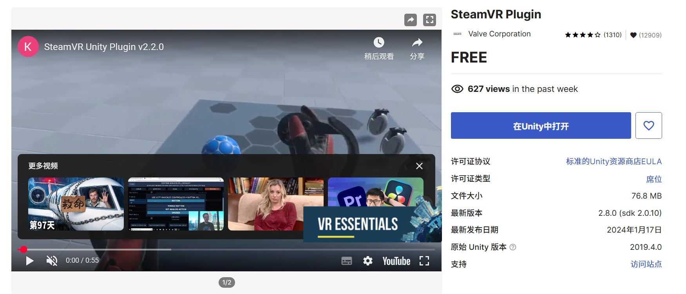

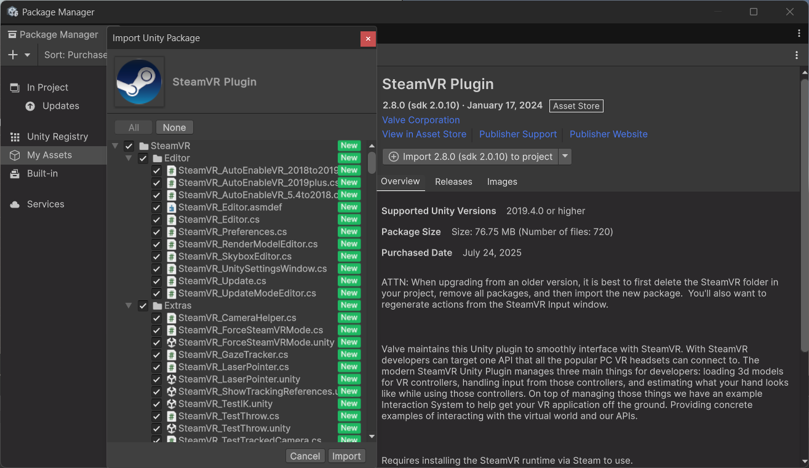

##### 2.在Steam客户端中安装SteamVR

安装并打开Steam客户端，在右上角搜索栏搜索SteamVR并安装并运行。

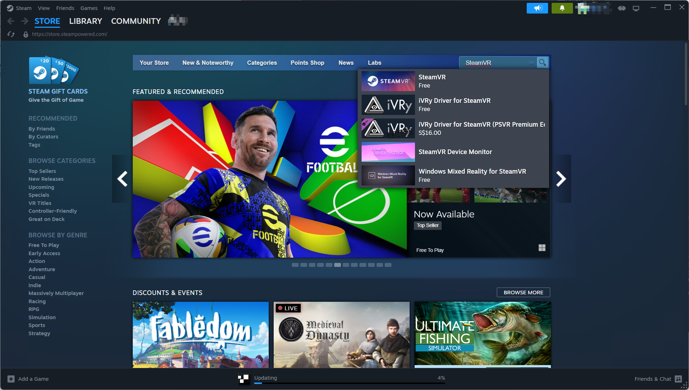

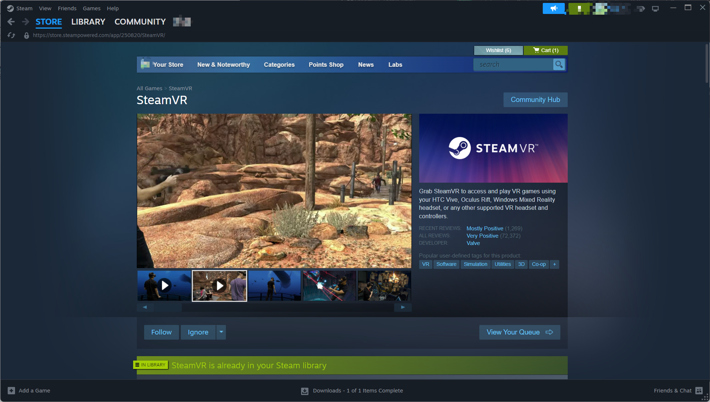

当电脑桌面上出现这个图标时，表明SteamVR正在运行。

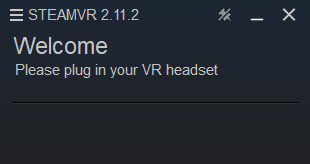

##### 3.运行示例程序

在Project窗口下打开Assets/SteamVR文件夹下， 运行Simple Sample场景。

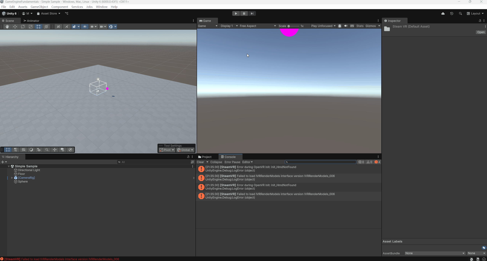

Console中出现报错信息是因为缺少VR硬件。

然后在Project窗口下打开Assets/SteamVR/InteractionSystem/Samples文件夹下，运行Interactions_Example场景。

虽然我们现在没有使用VR硬件，但是我们仍然可以使用鼠标+WASD来控制Player的运动和与物体的交互。当我们连接VR硬件运行场景时，我们就可以使用VR硬件的控制器来控制Player了。

##### 4.使用SteamVR插件自带的Player Prefab快速开发VR游戏场景

SteamVR插件自带的Player Prefab实现了VR游戏中Player的基本功能，我们可以复制该Prefab到自己开发的VR场景中使用。

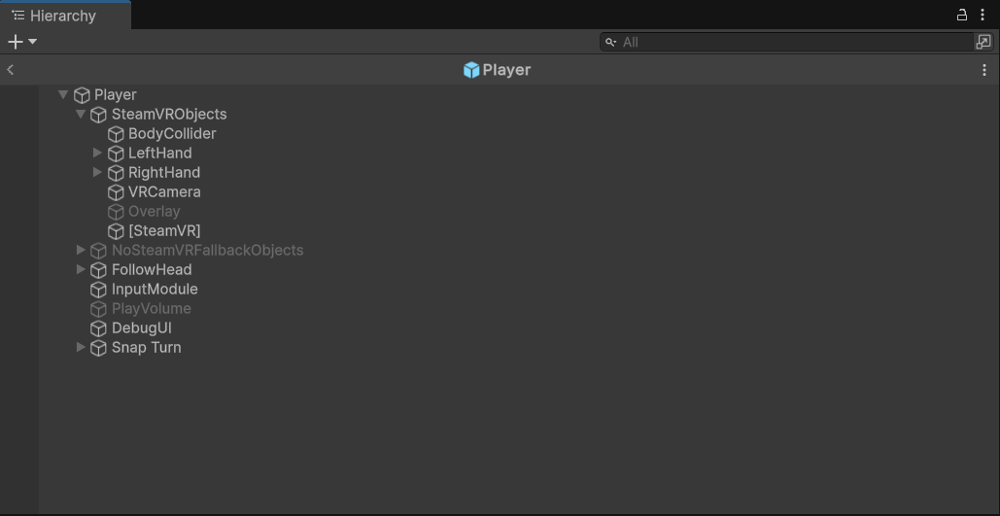

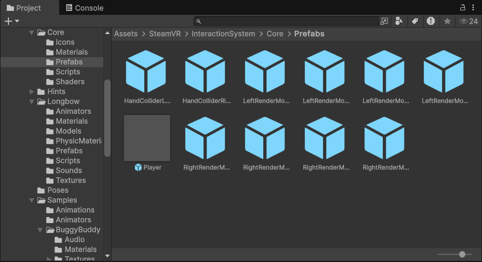

实现效果：

### 2.AR

#### AR

增强现实(Augmented Reality,AR)技术是借助[光电显示技术](https://baike.baidu.com/item/光电显示技术/10807699?fromModule=lemma_inlink)、[交互技术](https://baike.baidu.com/item/交互技术/2495046?fromModule=lemma_inlink)、多种[传感器技术](https://baike.baidu.com/item/传感器技术/53583?fromModule=lemma_inlink)和计算机图形与[多媒体技术](https://baike.baidu.com/item/多媒体技术/143527?fromModule=lemma_inlink)将计算机生成的[虚拟环境](https://baike.baidu.com/item/虚拟环境/6529153?fromModule=lemma_inlink)与用户周围的现实环境融为一体，使用户从感官效果上确信虚拟环境是其周围真实环境的组成部分。增强现实具有[虚实结合](https://baike.baidu.com/item/虚实结合/2963411?fromModule=lemma_inlink)、[实时交互](https://baike.baidu.com/item/实时交互/4976282?fromModule=lemma_inlink)、三维注册（将虚拟物体准确地定位到现实世界中的三维位置，并保持稳定对齐）的特点。（百度百科）

#### MR

混合现实（Mixed Reality, MR）是一种将[虚拟世界](https://baike.baidu.com/item/虚拟世界/859995?fromModule=lemma_inlink)与现实环境深度整合的技术。它结合[虚拟现实](https://baike.baidu.com/item/虚拟现实/207123?fromModule=lemma_inlink)*（Virtual Reality，VR）*与[增强现实](https://baike.baidu.com/item/增强现实/1889025?fromModule=lemma_inlink)*（Augmented Reality，AR）*，通过计算机生成的虚拟对象与现实世界进行实时互动，能够将虚拟元素叠加到现实环境中，还能让这些虚拟对象具备现实世界的物理特性（如实时物理交互和动态反应）。（百度百科）

#### AR内容创作原理

AR的核心原理可以总结为三步：

1. **识别现实世界（Tracking & Recognition）**
    设备通过摄像头识别环境中的图像、物体、位置或空间（例如平面、特定图像标记、GPS等）。
2. **虚实对齐（Registration）**
    把虚拟内容精准地定位在现实世界中（比如某个桌面上或墙面上），保持稳定、不漂移。
3. **渲染与交互（Rendering & Interaction）**
    使用图形渲染技术，将虚拟物体实时渲染，并允许用户与之交互（例如旋转、缩放、点击）。

其中实现虚实对齐的方法有如下两种

- 基于标记的跟踪（Marker-based Tracking）

  指AR系统**借助特定的可识别图像/图案（Marker）**来实现三维注册和跟踪。常见的标记如黑白方框（如二维码、Vuforia 的图像目标）。

  

- 无标记跟踪（Markerless Tracking）

  **不依赖任何特定图像或二维码**，通过识别**环境中的平面、几何特征或位置信息**来实现AR虚拟物体的放置和跟踪。

| 特性             | 基于标记的跟踪       | 无标记跟踪（SLAM）       |
| ---------------- | -------------------- | ------------------------ |
| 是否需要图像标记 | 是                   | 否                       |
| 对环境要求       | 低                   | 高（光线、纹理丰富）     |
| 稳定性           | 稳定，识别精度高     | 有时受干扰               |
| 应用范围         | 教育、图像展览、图书 | 家具试放、地图导航、游戏 |
| 技术依赖         | 图像识别             | SLAM、IMU、深度感知      |

#### 使用Unity游戏引擎进行AR开发 - 以Vuforia Engine AR为例

使用基于图片标记跟踪的 AR 内容开发流程：

1. 配置项目环境
2. 创建并上传图片标记
3. 导入标记数据库
4. 场景中添加图像识别目标
5. 绑定虚拟内容到标记上

##### 1.导入Vuforia Engine Plugin

打开Asset Store搜索Vuforia Engine插件，并在Package Manager中导入到游戏工程里。

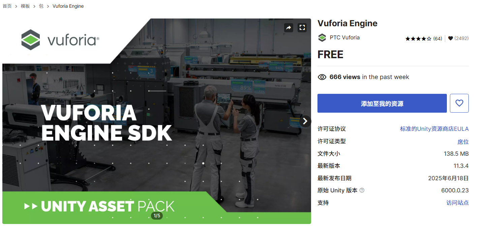

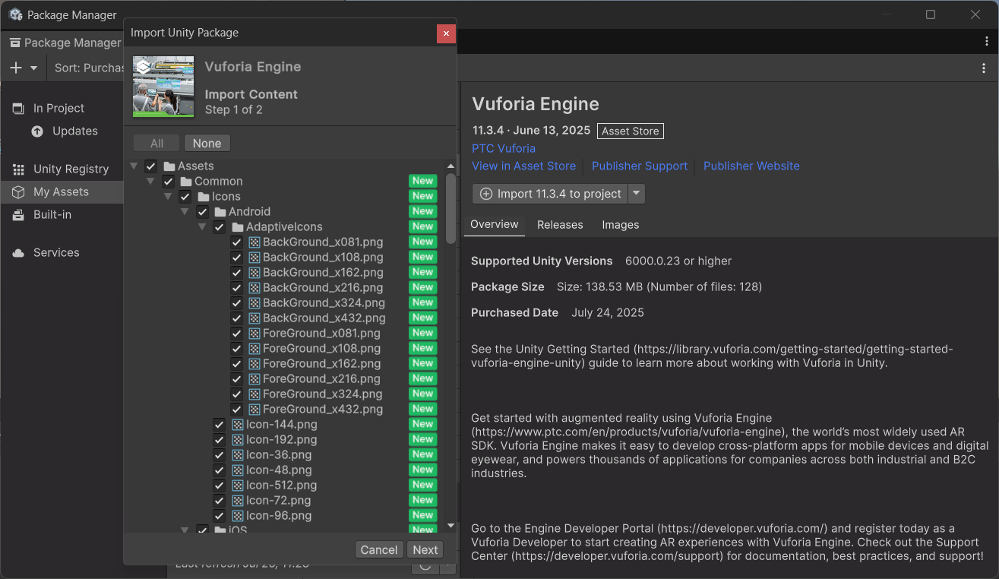

##### 2.在vuforia engine网站中创建License，并创建标记数据库并添加图像类型标记

打开[Account | Engine Developer Portal](https://developer.vuforia.com/develop/dashboard)注册一个账号，点击Plan & Licenses界面中的Generate Basic License创建一个新的License。

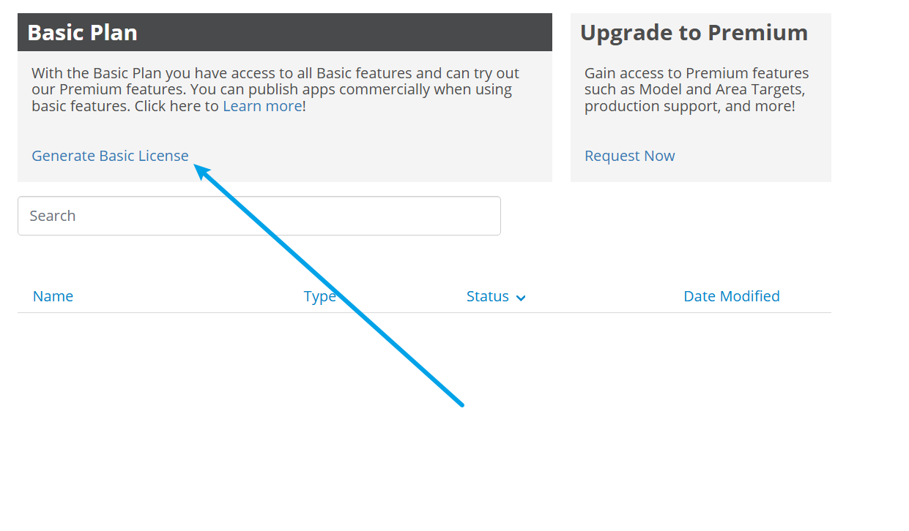

为新的License起一个名字，然后点击Confirm。

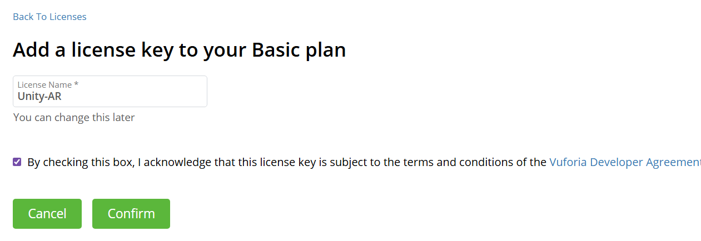

点击新生成的License，将license key保存下来, 待会填入Unity工程中。

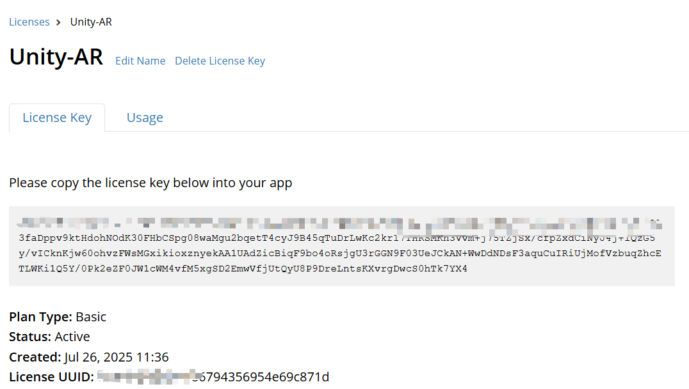

点击Target界面中的Generate Database生成一个新的标记数据库。

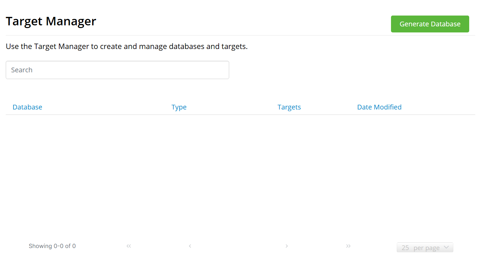

输入数据库的名称，点击Generate

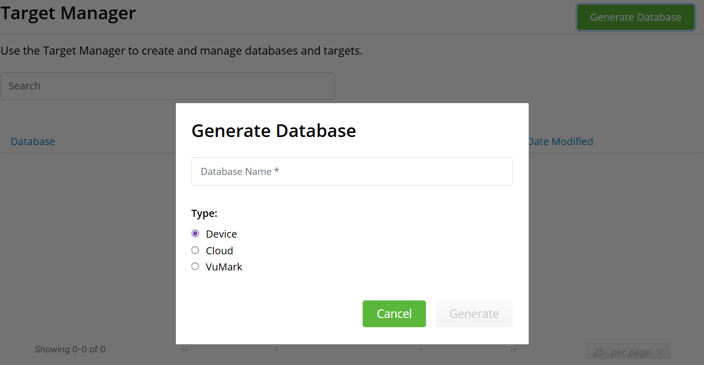

点击新生成的数据库，点击Add Target添加一个新的图片类型的标记。

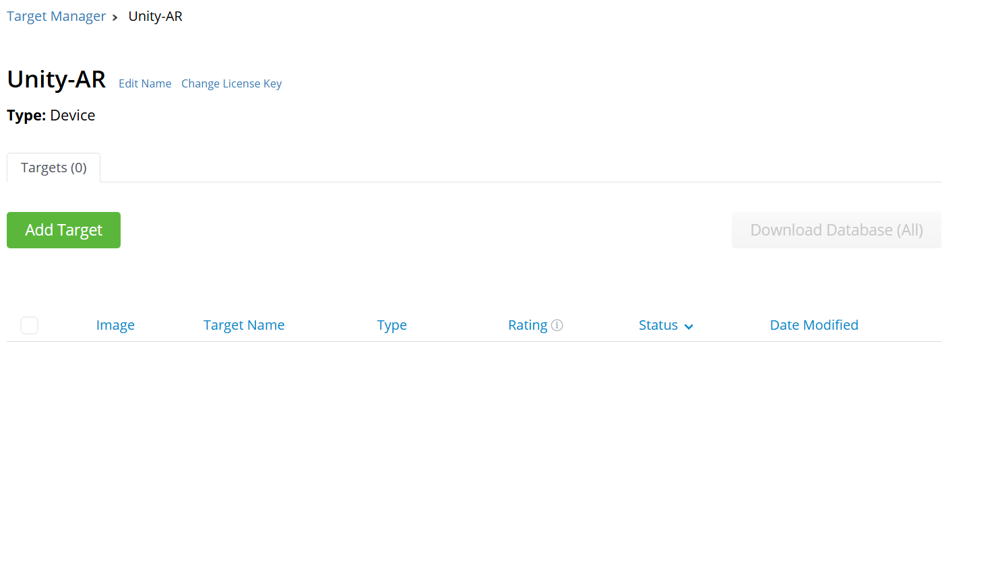

点击选择文件，上传一张要作为图像标记的图片，置它的将在Unity中的宽度和这个图像标记的名称，点击add。

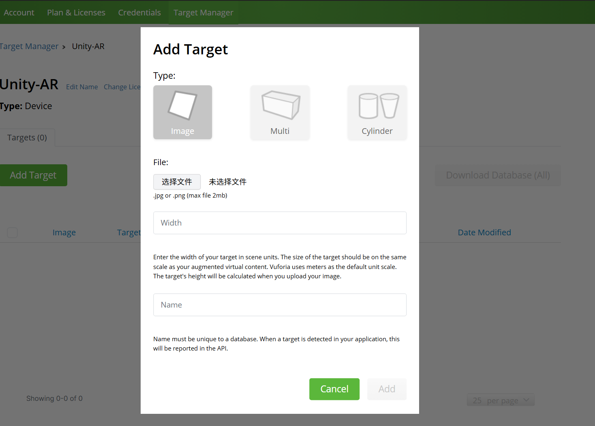

当Target的Status属性为Active时，表示该Target添加成功

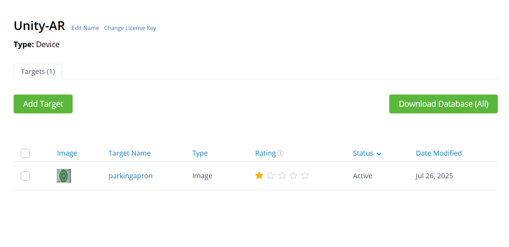

##### 3.将标记数据库导入Unity

当将所有的图像类型的标记添加完成后,点击Download Database下载标记数据库。

选择Unity Editor，点击Download，会下载一个.unitypackage后缀的文件，将其导入Unity工程中。

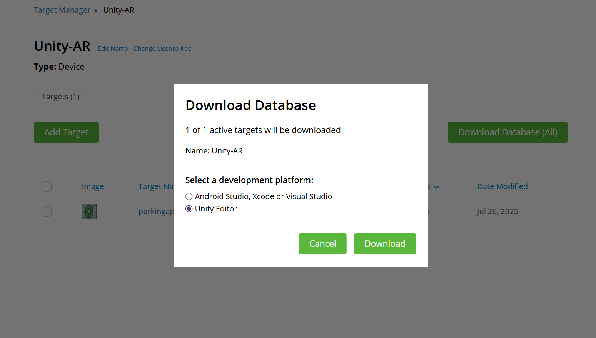

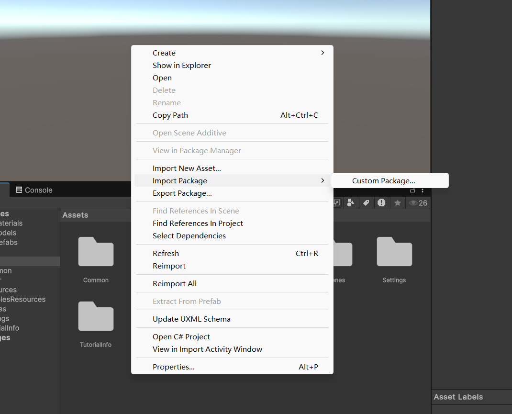

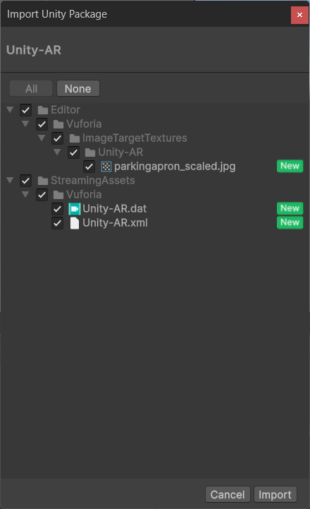

##### 4.在Unity场景中添加AR图像识别目标游戏对象, 并绑定虚拟内容到标记上

在Hierarchy窗口中点击鼠标右键, 选择Vuforia Engine，添加一个AR Camera游戏对象和一个Image Target游戏对象，隐藏或者删除Main Camera。

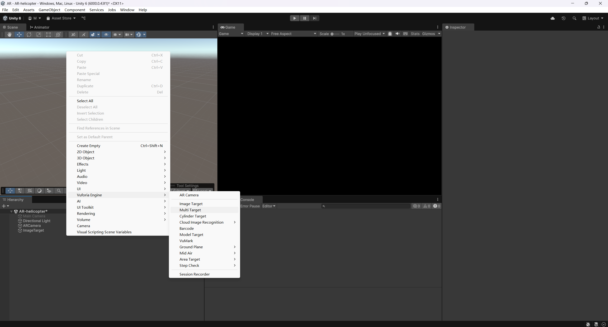

在添加一个方块作为ImageTarget游戏对象的子对象，调整方块的大小、姿态、位置。

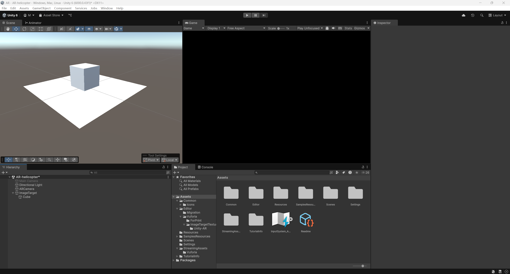

在ImageTarget窗口中的Image Target Bahaviour组件中选择一张Vuforia内置的图像类型标记的图片。

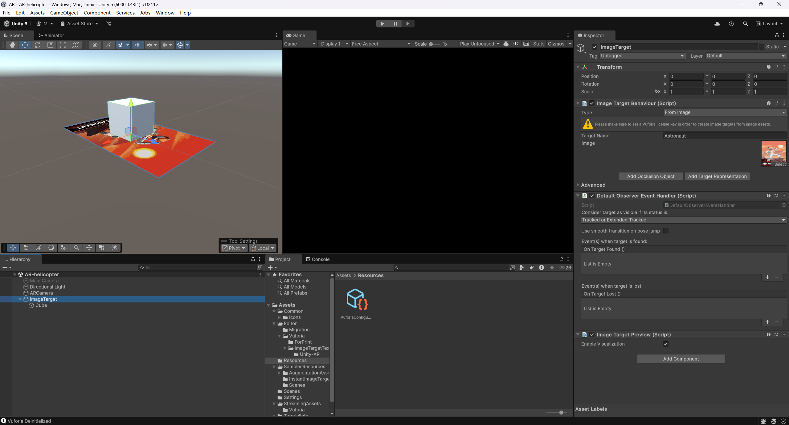

将这张图片保存下来，展示到手机或者平板屏幕上，点击运行游戏，我们会发现，游戏画面已经变成了摄像头捕捉的现实场景画面，但是方块并没有出现在图像类型标记的图片上。

这是因为我们没有在Unity中配置License Key。点击打开Project窗口中的Asset - Resources文件夹中的VuforiaConfiguration文件，在Inspector窗口中输入我们保存的License Key。

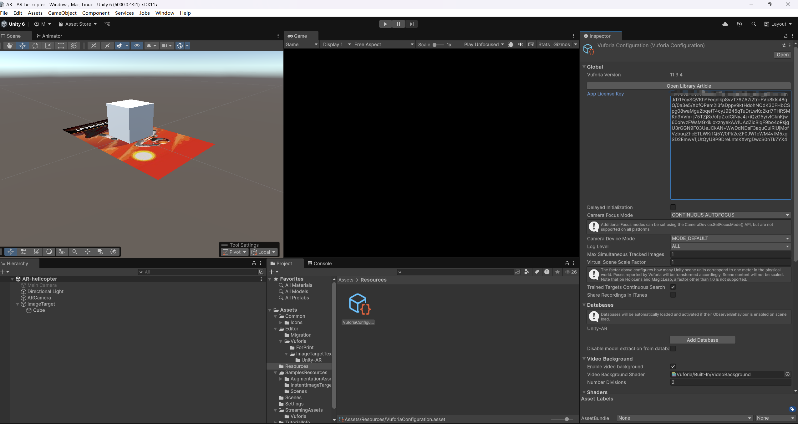

现在运行游戏，方块出现在图像类型标记的图片上。

现在我们在ImageTarget窗口中的Image Target Bahaviour组件中的图片选择为我们添加的图像标记类型的图片。

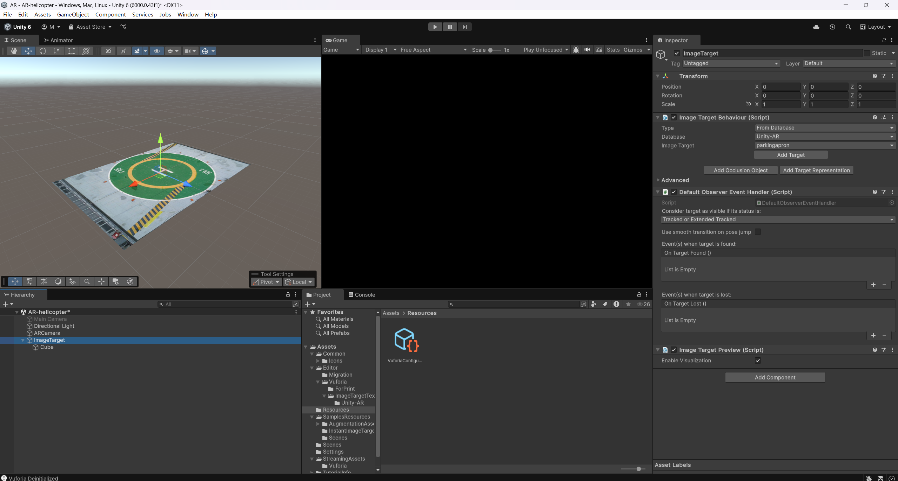

这次我在Image Target下添加了一个直升机模型，运行游戏效果如下：

