# 性能优化

### 1.性能审查

#### 游戏性能优化的重要性

游戏性能优化对于提升用户体验至关重要。在开发过程中，我们需要：

1. **平衡质量与速度**：确保游戏的视觉效果和运行速度能够达到最佳平衡。
2. **考虑发布平台特点**：不同平台的硬件性能不同，必须根据平台特点进行优化。移动平台的硬件资源有限，因此对比PC或控制台平台需要更多的优化。
3. **解决性能瓶颈**：识别和解决影响游戏性能的瓶颈问题，确保游戏能够流畅运行，避免卡顿或延迟。

通过合理的优化策略，我们能够提升游戏在不同设备上的表现，提供更好的游戏体验。

#### 游戏性能审查

游戏性能审查是为了识别和解决性能瓶颈，确保游戏能够在不同平台上流畅运行。游戏性能审查可以在游戏开发过程中进行，也可以在开发完成后进行。以下是常见的审查项目：

1. **CPU使用情况**：检查CPU的负载，确保游戏逻辑和运算不会过度消耗处理器资源。
2. **渲染**：分析渲染过程中的性能瓶颈，如过多的绘制调用或复杂的图形渲染。
3. **内存**：检查游戏的内存使用情况，避免内存泄漏和过度的内存消耗。
4. **音频**：评估音频资源的加载和播放，避免过多音频处理对性能造成影响。
5. **物理**：检查物理引擎的性能，确保物理计算不会导致游戏卡顿或延迟。
6. **GPU使用情况**：监控GPU的使用，确保图形渲染和计算不会超出GPU的能力范围。
7. **全局光照(Global Illumination)**：检查全局光照系统的性能影响，优化光照计算，避免不必要的性能开销。
8. **用户界面(UI)**：评估UI的性能，避免复杂或频繁更新的UI元素导致帧率下降。

通过对这些项目的审查，可以帮助开发团队及时发现并优化游戏性能瓶颈，从而提升游戏的整体表现。

#### 在Unity游戏引擎中进行游戏性能审查

新建一个测试游戏场景

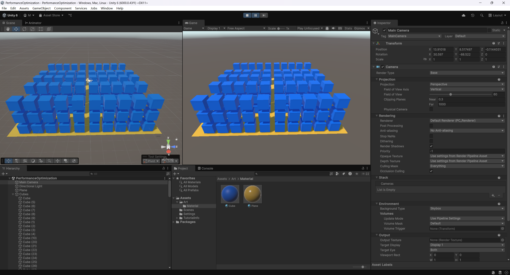

打开Window下拉菜单 - Analysis - Profile窗口

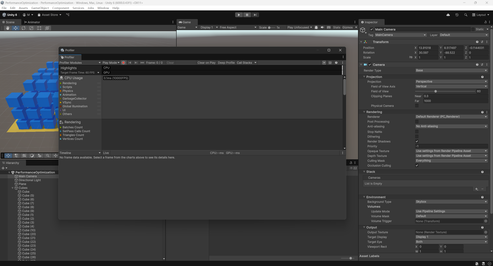

点击运行游戏可以在Profile窗口上看到详细的性能统计信息。

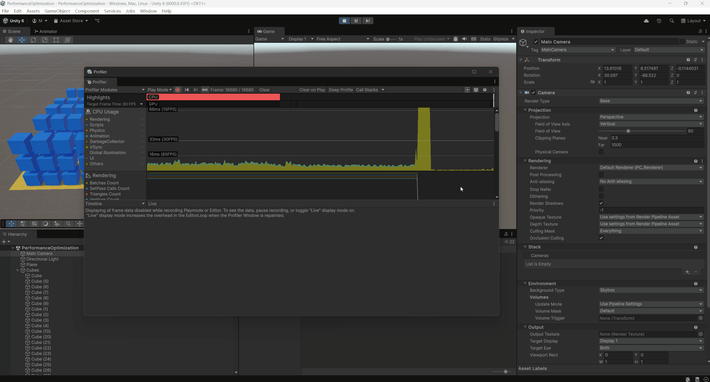

点击Clear On Play可以清除之前记录的性能统计信息

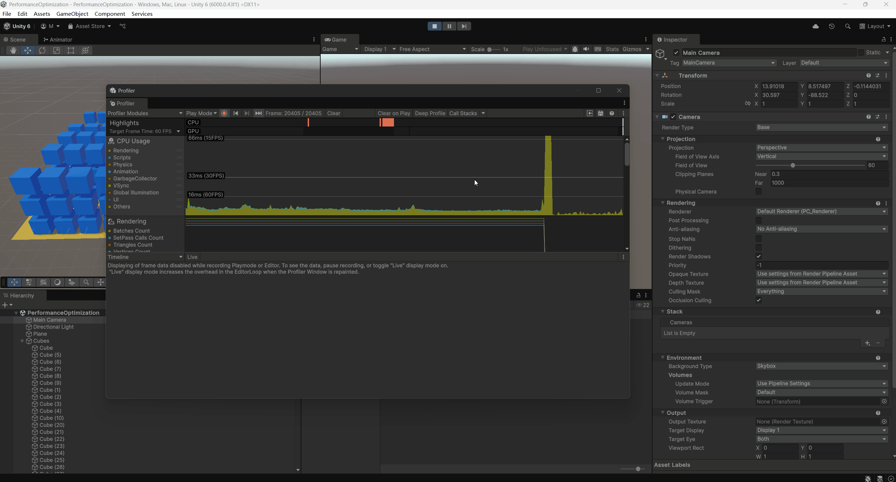

点击右上角的保存图标可以保存记录的性能统计数据，可以用来优化前后对比

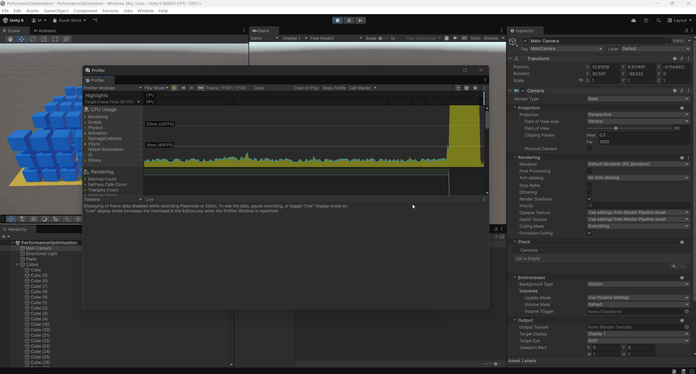

### 2.代码优化

#### 早期游戏的代码与游戏性

早期电子游戏的代码架构常常直接塑造了它们的核心玩法体验——在那段内存与计算能力极度受限的年代，程序员不得不将“玩法”与“实现”紧密绑在一起，下面两个案例可以很好地说明：

1. **《太空入侵者》（1978）——单发子弹与节奏感**

   - **技术限制**：硬件一次只能处理极少量的活动精灵（sprite），同时主 CPU 运行频率也很低。
   - **设计产物**：玩家每次只能发射一颗子弹，必须等之前的子弹击中目标或飞出屏幕才可再次射击。
   - **游戏性影响**：被动的射击节奏迫使玩家思考最佳时机，而非疯狂扫射；也因此“子弹管理”成为游戏策略的一部分。

   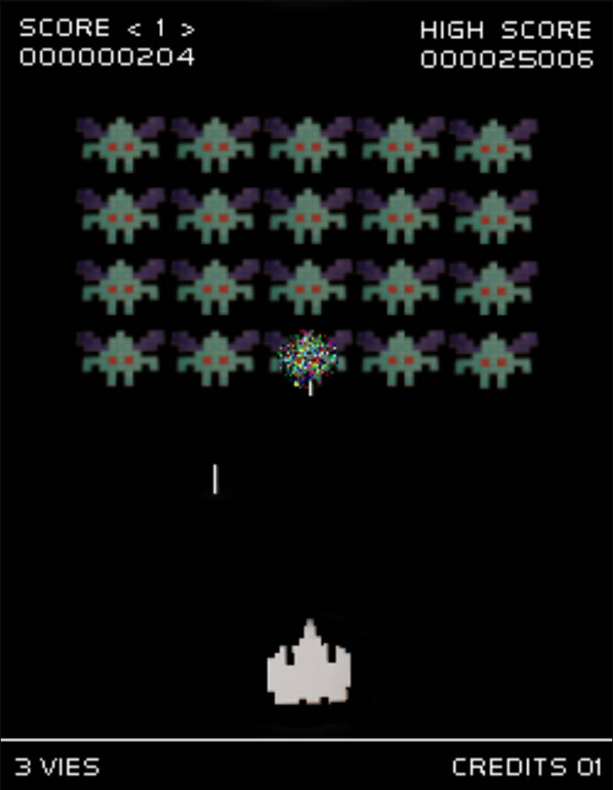

2. **《吃豆人》（1980）——有限状态的智能体**

   - **技术限制**：每个幽灵 AI 逻辑都要极度精简，几乎没有空间做复杂计算。
   - **设计产物**：四个幽灵各自只有 2–3 条简单规则（如“靠近”、“分散”、“追踪”）和有限的状态切换。
   - **游戏性影响**：看似复杂的追击与逃脱模式，实际源自拼凑出来的简单状态机，让玩家既可预测幽灵行为，又因状态转换而保持紧张感。

   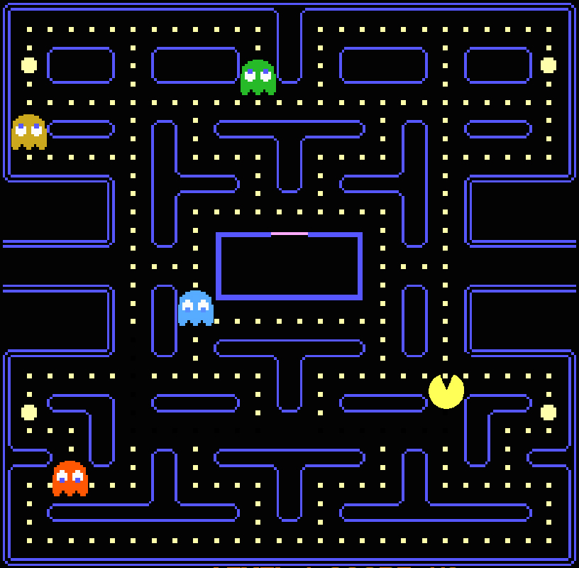


#### Unity脚本中高消耗性能函数

| 函数/API                                      | 说明                 |
| --------------------------------------------- | -------------------- |
| `Instantiate`                                 | 动态生成新对象       |
| `Resources.Load` / `AssetBundle.LoadAsset`    | 运行时加载资源       |
| `GameObject.SetActive(true/false)`            | 启用/禁用整个物体    |
| `GameObject.AddComponent`                     | 运行时给物体添加组件 |
| `CharacterController.Move`                    | 每帧物理移动         |
| `AudioSource.Play` / `AudioSource.volume` / … | 音频播放与控制       |
| `SystemInfo.batteryLevel`                     | 获取电量信息         |
| `Application.internetReachability`            | 网络状态检测         |

#### 代码优化建议

| 问题场景                       | 优化手段                                   | 备注                         |
| ------------------------------ | ------------------------------------------ | ---------------------------- |
| 使用通用 3D 刚体做所有物理模拟 | 限定为 2D 刚体（`Rigidbody2D` + 2D 碰撞）  | 避免 3D 物理开销             |
| 子弹采用标准物理碰撞           | 为子弹定制轻量级碰撞检测逻辑               | 可用射线检测或手写 AABB 检测 |
| 不断新建/销毁物体              | 引入对象池（Object Pool）                  | 预先分配、循环复用           |
| 使用大量三维模型做动画         | 换用骨骼动画或动画精灵（Sprite Animation） | 减少网格顶点与 draw call     |
| 每帧都做复杂运算               | 将耗时计算隔帧执行并缓存结果               | 如路径查找、距离计算等       |
| 所有脚本都自动生成 `Update()`  | 删除不必要的 `Update()` 方法               | 只有确实需要每帧刷新的才保留 |

#### 优化案例

**1.避免频繁 SetActive**

- **场景**：大量物体需要频繁激活/隐藏。
- **优化**：不调用 `SetActive`；隐藏时将 `transform.position` 移至屏幕外，显示时再移回可见区。

**2.使用对象池**

- **场景**：子弹、特效等对象频繁生成/销毁。
- **优化**：游戏开始时预先生成一定数量的对象，使用时启用，闲置时禁用并回池。

**3.统一音效管理**

- **场景**：音效播放时频繁创建/销毁 `AudioSource`。
- **优化**：编写 `AudioManager`，预加载音效资源并复用固定数量的 `AudioSource` 实例。

**4.精简 MonoBehaviour**

- **场景**：很多脚本自动带有空 `Update()`。
- **优化**：删除无用的 `Update()`（或其它生命周期方法），只有必要时才添加。

### 3.内存管理

#### 内存管理概述

**定义**：内存管理是指软件运行时对计算机主存储器资源（RAM）的分配、使用与回收技术。目标是在保证性能和稳定性的前提下，最大化内存利用率。

**重要性**：

- 对于内存受限的设备（如移动设备、嵌入式系统），合理的内存管理是提升应用性能和用户体验的关键。
- 游戏开发中，频繁的内存分配与回收会导致卡顿和帧率下降。

#### 自动内存管理机制

1. **内存分区**
   - **栈（Stack）**：存放局部变量和函数调用帧，分配和回收速度快，但空间有限，生命周期短。
   - **堆（Heap）**：用于动态分配内存，空间大，可存放生命周期更长的数据，但分配和回收相对耗时。
2. **垃圾回收（GC, Garbage Collection）**
   - 系统定期扫描堆中不再被引用的对象，并将其回收。
   - 优点：自动回收，简化程序员管理。
   - 缺点：回收过程会暂停应用执行（Stop-the-world），消耗 CPU 时间，可能导致性能抖动。

#### 自动内存管理对性能的影响

- **GC 触发时机难以预测**，无法精确控制何时进行回收。
- **频繁创建和销毁临时对象**会增加 GC 负担，导致更多停顿。
- **堆栈回收**快速且开销小，但数据量大或生命周期长的对象必须放在堆上。

#### 优化策略

1. **减少临时对象分配**
   - 避免在每帧或频繁调用的函数中创建新的字符串、数组、集合等。
   - 尽量复用对象：使用对象池（Object Pooling）。
2. **缓存计算结果**
   - 对于不常变化的数据，可提前计算并缓存，避免重复分配。
3. **延迟或分时回收**
   - 手动调用 `GC.Collect()` 时机要慎重，仅在合适的时机（如场景切换）执行。
4. **分析工具辅助**
   - 使用 Unity Profiler工具定位大对象分配点。

#### 优化案例

**场景**：在游戏更新循环 (`Update`) 中频繁生成字符串用于更新分数显示，导致大量 GC 分配

**优化前代码**：

```c#
using UnityEngine;
using System.Collections;

public class ExampleScript : MonoBehaviour
{
    public GUIText scoreBoard;
    public int score;

    void Update()
    {
        string scoreText = "Score:" + score.ToString();
        scoreBoard.text = scoreText;
    }
}
```

**优化后代码**：

```C#
using UnityEngine;
using System.Collections;

public class ExampleScript : MonoBehaviour
{
    public GUIText scoreBoard;
    public int score;

    // Cache the display string to avoid per-frame allocations
    private string _scoreText;
    private int _oldScore = -1;

    void Update()
    {
        // Only update string when score changing
        if (score != _oldScore)
        {
            _scoreText = "Score:" + score.ToString();
            scoreBoard.text = _scoreText;
            _oldScore = score;
        }
    }
}
```

### 4.渲染优化

渲染（Rendering）是游戏性能中最耗资源的环节之一，直接与图形学紧密相关。优化渲染可以显著提高帧率、降低延迟，并减少功耗。

#### 渲染瓶颈来源

**GPU（像素填充率 & 内存带宽）**

- 过高的分辨率或过量的像素填充会消耗大量显存带宽。
- 如果降低渲染分辨率后帧率大幅提升，通常说明 GPU 已达到瓶颈。

**CPU（Draw Call & 批次提交）**

- 每个 Draw Call（批次提交）都存在固定的开销，过多的 Draw Call 会让 CPU 忙于提交命令，拖慢整体流水线。
- 合并相邻物体、复用材质后性能提升，则往往是 CPU 成为瓶颈。

#### 针对GPU优化

**减少多边形数量**

- 优化网格：删除被遮挡或镜头之外的三角面。
- 简化模型：用法线贴图（Normal Map）替代高模细节。

**合并纹理（Texture Atlas）**

- 将多个小纹理打包到同一大纹理中，减少纹理切换带来的带宽与状态切换开销。

**合理控制分辨率**

- 对不同平台与设备，动态调整渲染分辨率或开启动态分辨率缩放（Dynamic Resolution）。

**优化着色器**

- 精简 Shader 中的分支与复杂运算。
- 使用延迟渲染（Deferred Rendering）来平衡光照性能。在移动端，如果只能使用前向渲染（Forward），则必须严格控制场景中的灯光数量。

#### 针对CPU优化

**批处理（Batching）**

- **静态批处理（Static Batching）**：将不运动的物体标记为 Static，Unity 会自动合并相邻或相似网格，并统一使用同一材质，减少 Draw Call。在 “Player Settings” → “Other Settings” 中勾选 **Static Batching**启用（PC、IOS、Android默认启用）
- **动态批处理（Dynamic Batching）**：针对小型动态物体，Unity 会自动合并，但需注意顶点数和材质数量限制。

**合并网格与材质复用**

- 在场景构建时，将相邻或相似的物体合并为同一个 Mesh，并统一使用相同的材质，以减少 Draw Call。

**遮挡剔除与 LOD**

- **遮挡剔除（Occlusion Culling）**：剔除被其他物体完全遮挡的对象。
- **层次细节（LOD）**：根据与相机距离切换低/中/高细节模型，降低远处物体渲染成本。

**光照与阴影烘焙**

- 尽量使用静态光照贴图（Lightmap），把复杂的光照计算提前烘焙到贴图中。
- 对于实时光源与阴影，限制数量与距离，或使用混合模式（Mixed Lighting）。

#### 在Unity引擎中使用遮挡剔除（Occlusion Culling）技术优化渲染

##### 1.搭建测试游戏场景

在第一节的测试游戏场景中创建一堵墙将立方体分隔开。墙体作为遮挡体（Occluder），后方的立方体作为被遮挡体（Occludee）。

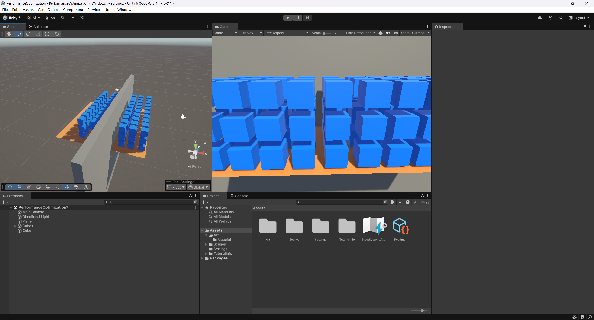

##### 2.开启相机的遮挡剔除选项

选中Main Camera，在 Inspector 中确认 **Occlusion Culling** 已勾选（默认开启）。

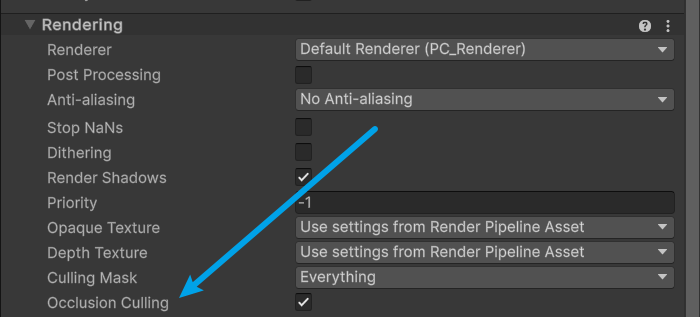

##### 3.标记参与遮挡剔除的静态对象

对所有参与遮挡剔除的物体（墙体和 Cubes）同时勾选：

- **Occluder Static**
- **Occludee Static**

> 只有静态标记过的对象才会被 Unity 的遮挡剔除系统处理。

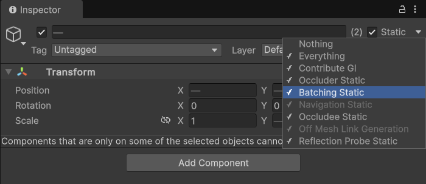

##### 4.打开Occlusion Culling设置窗口

菜单栏选择 **Window → Rendering → Occlusion Culling**，弹出面板包含三个标签页：**Object**, **Bake**, **Visualization**。

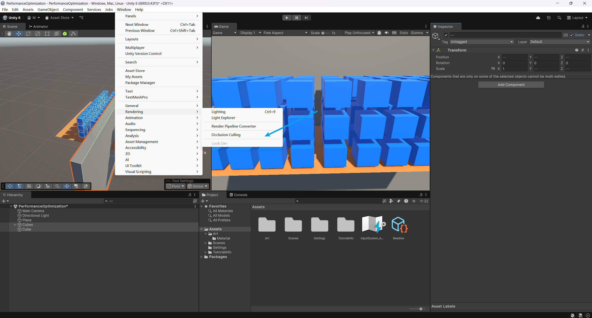

##### 5.设置并烘焙（Bake）

切换到 **Bake** 标签页。

调整关键参数：

- **Smallest Occluder**：最小遮挡体大小（米）。
- **Smallest Hole**：最小可见孔洞尺寸（米）。
- **Backface Threshold**：背面剔除角度阈值（度）。

点击 **Bake** 按钮，开始生成遮挡剔除数据。

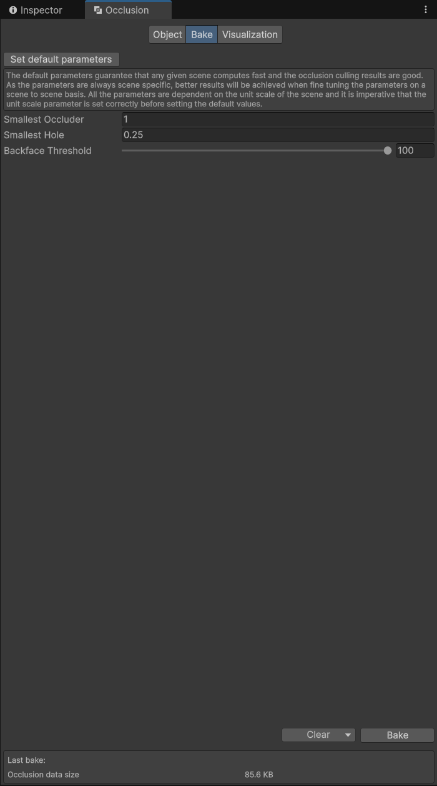

##### 6：查看剔除效果

切换到 **Visualization** 标签页。

在场景视图中移动相机，可见被墙体完全遮挡的 Cubes 不再被渲染。


